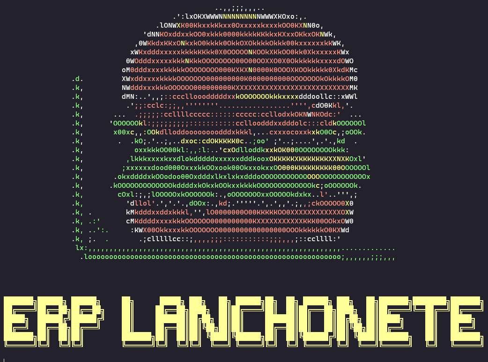

<!-- Área do Banner -->
<div align="center" style="background-color: white; max-width: 100%;">
  
</div>

<!-- Título e breve descrição do repositório -->
<div align="center"><h1>ERP Lanchonete</h1><p><b>A straightforward example demonstrating database integration.</br>Technologies used:</b></p></div>

<!-- Ícones ou links das tecnologias usadas -->
<p align="center">
  <a href="https://www.python.org/" title="Python"></a>
  +
  <a href="https://www.mysql.com/" title="MySQL"></a>
</p>

<!-- Escudos de licença e contador de contribuidores -->
<p align="center">
  <a href="https://github.com/N-CPUninter/Modelo_Aula/graphs/contributors">
    
  </a>
  <a href="https://opensource.org/license/gpl-3-0">
    
  </a>
</p>

<!-- Descrição do repositório e demais dados -->
## Description

ERP Lanchonete is an educational example that demonstrates the integration of software with a relational database. Designed as a proof of concept, it features a menu system built entirely on a tree data structure. The project serves as a practical guide for small to medium-sized eateries, showcasing how to streamline inventory management, order processing, and customer relationship management through efficient database integration.

## ASCII ART Welcome Screen
<div align="center" style="background-color: white; max-width: 100%;">
  
</div>

# Highlights

- MySQL integration 
- Splash screen in ASCII Art
- Menu in tree data structure
- Different types of data visualization from database.

## Participants

| [](https://github.com/guipatriota) |
| :------------------------------------------------------------------------------------------------------------------------: |

| [Prof. Guilherme Patriota](https://github.com/guipatriota)

# How to run:

1. Create virtual environment:
```bash
conda env create --prefix ./.conda --file environment.yml
```

2. Active environment:
 
Windows:
```bash
conda activate .\.conda
```

Linux/Mac:
```bash
conda activate ./.conda
```

3. Run:

Windows:
```bash
.conda\python.exe .\lanchonete.py
```

Linux/Mac:
```bash
./.conda/python.exe ./lanchonete.py
```

